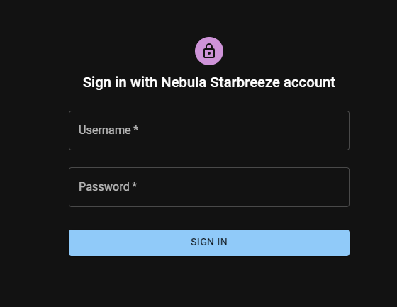
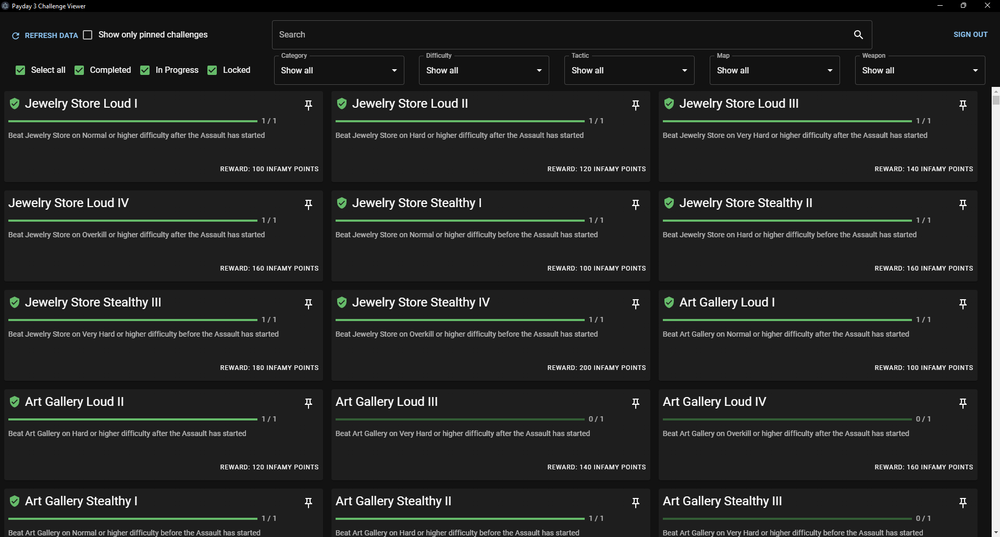
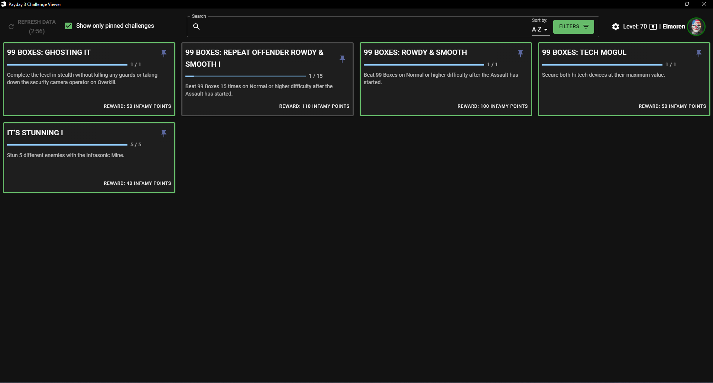
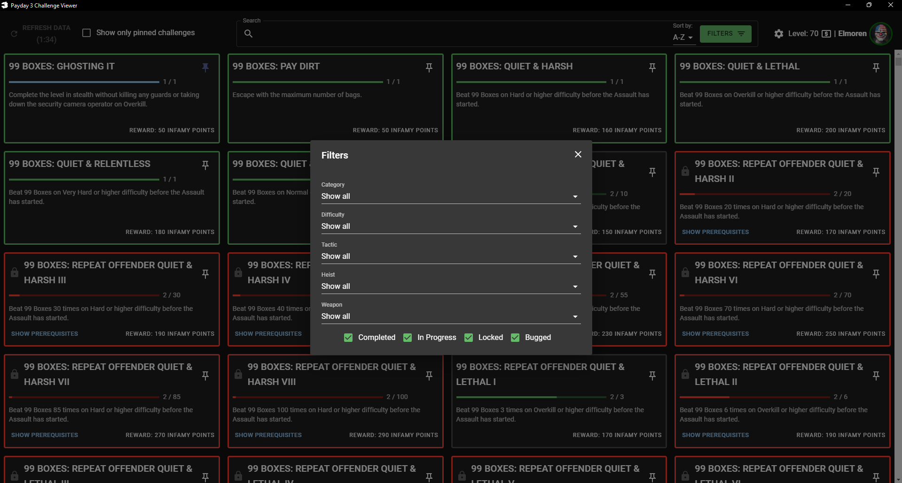
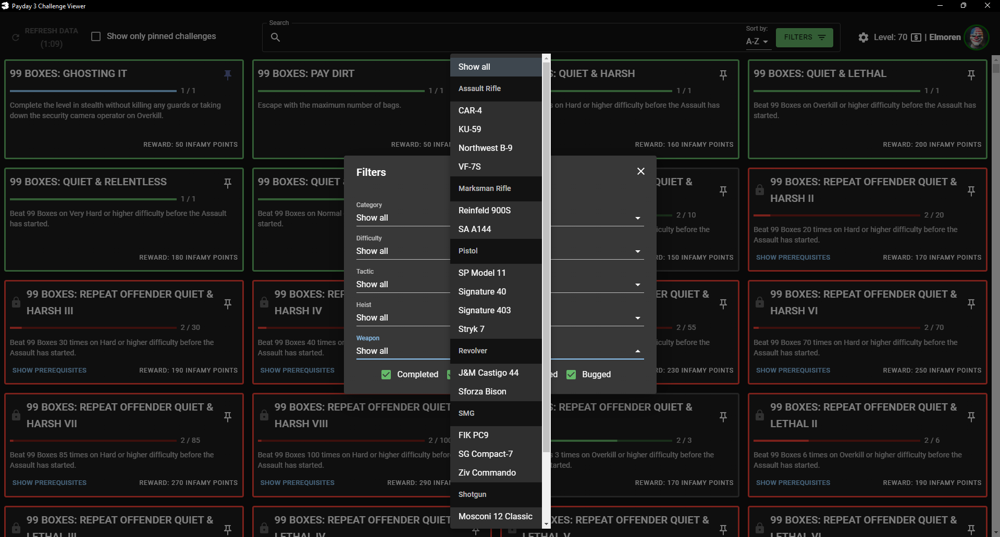
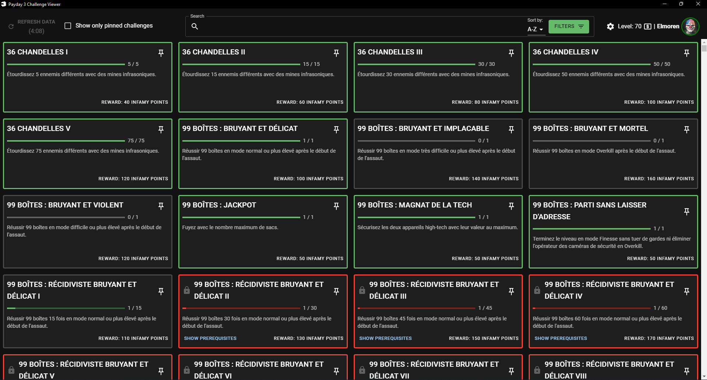
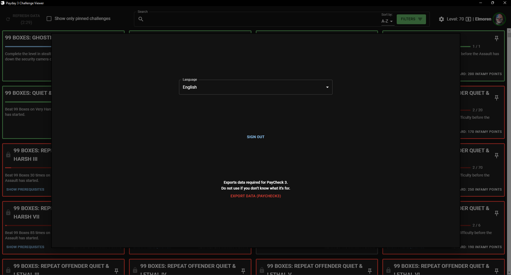
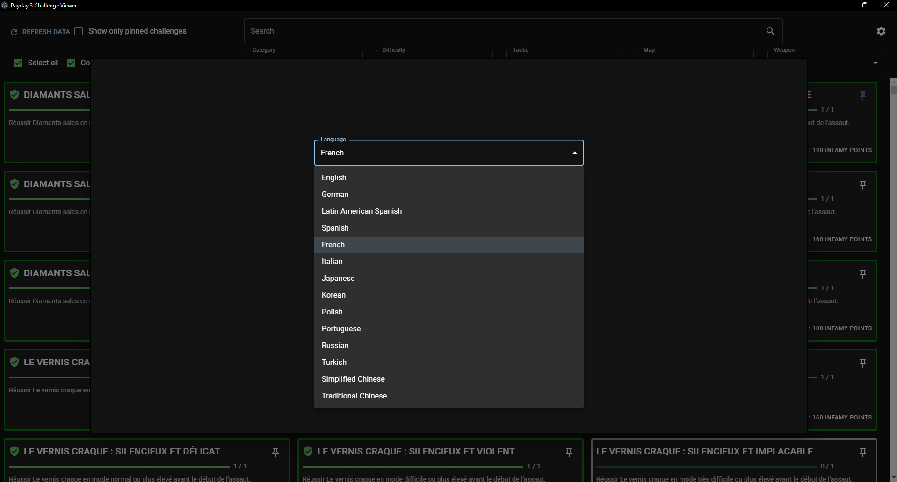

# Payday 3 Challenge Viewer
## ⚠ **WE ARE IN THE PROCESS OF REWRITING THE CODEBASE, PLEASE TAKE THIS INTO ACCOUNT WHEN OPENING PRs** ⚠
This application allows you to check your challenge progression from outside the game and have an overall better experience tracking them, compared to the in-game one.

# Features

- Shows all the challenges inside the game and your progression synced to them from the official Starbreeze API
- Features all 14 languages currently supported in the game.
  - English 
  - German (de_DE)
  - Latin American Spanish (es_419)
  - Spanish (es_ES)
  - French (fr_FR)
  - Italian (it_IT)
  - Japanese (ja_JP)
  - Korean (ko_KR)
  - Polish (pl_PL)
  - Portuguese (pt_BR)
  - Russian (ru_RU)
  - Turkish (tr_TR)
  - Simplified Chinese (zh_Hans)
  - Traditional Chinese (zh_Hant)
- You can filter the challenges by *Categories*, *Difficulty*, *Tactics*, *Heist* and *Weapons*
- You can pin challenges to keep track of them easier
- If you use the [PayCheck3](https://modworkshop.net/mod/44270) server emulator, you can export your item stats to use them inside the emulator.

*There are still a few texts that are still in english, regardless what language you pick (The labels before the filters, the selectbox texts, etc), but all the challenges should be in their respective languages. If you find a translation error within them please don't report it to us. All the text are ripped directly from the game, so if theres something wrong it's just as wrong in-game.*

# Disclaimer

- You must own a legitimate copy of **PAYDAY 3** to use this software, which can be purchased at *https://www.paydaythegame.com/payday3/#buy*
- The contributors of **Payday3ChallengeViewer** in no way support piracy. We're sorry to have caused any confusion that this could be used for piracy.
- This project is in no way affliated or endorsed by **Starbreeze Entertainment**.
- The project only support **Windows** as of right now.

# Interface

# Usage

1. Click on the latest release on the right side.
2. Pick which version you want to download. For **portable version** you need to download the "Payday.3.Challenge.Viewer.--version--.exe", but if you have problems launching it, you may need to download the **setup version** instead "payday-3-challenge-viewer-setup.exe".
3. Open the app and log in using your [Starbreeze account](https://nebula.starbreeze.com)
4. Enjoy

# Data storage

This program stores your data (access, refresh token, selected language, pinned challenges) inside your local storage.

# Contributors

- [@HW12Dev](https://github.com/HW12Dev)
  - Helped to understand connection to Starbreeze API and requests
- [@DudiVok](https://github.com/DudiVok)
  - Improved UI & added functionalities
- [@InsulatorGMan](https://github.com/InsulatorGMan)
  - Codebase, Features, UI
- [All-Ki](https://github.com/All-Ki)
  - Bug fixes
